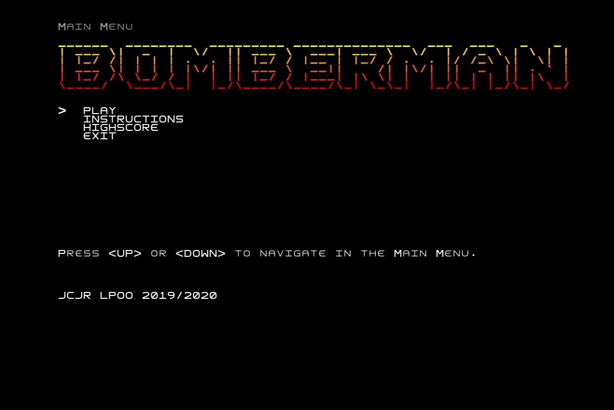

# LPOO_41 - BomberMan

(Versão simplificada do relatório. Versão completa em [docs/Readme.md](docs/Readme.md).)

Neste projecto pretendemos desenvolver um jogo semelhante ao clássico **BomberMan**, usando funcionalidades do jogo originais e acrescentando outras que entendemos que contribuem para um jogo mais apelativo e interessante.

Projecto desenvolvido no âmbito da UC LPOO 2019/20 por João Carlos Machado Rocha Pires (up201806079) e João Oliveira da Rocha (up201708566)

## *Gameplay*

## *Screenshots*

### *Main Menu Screen*

### *Instructions screen*

### *Highscores screen*

### *Game screen*

### *Paused Menu*

### *Game Over screen*

### *Time's Up*

### *Level Completed*

### *Final Highscore*

### *Power-Ups*

### *Key-Portal*

### *Bomb (Planted vs Exploding)*

