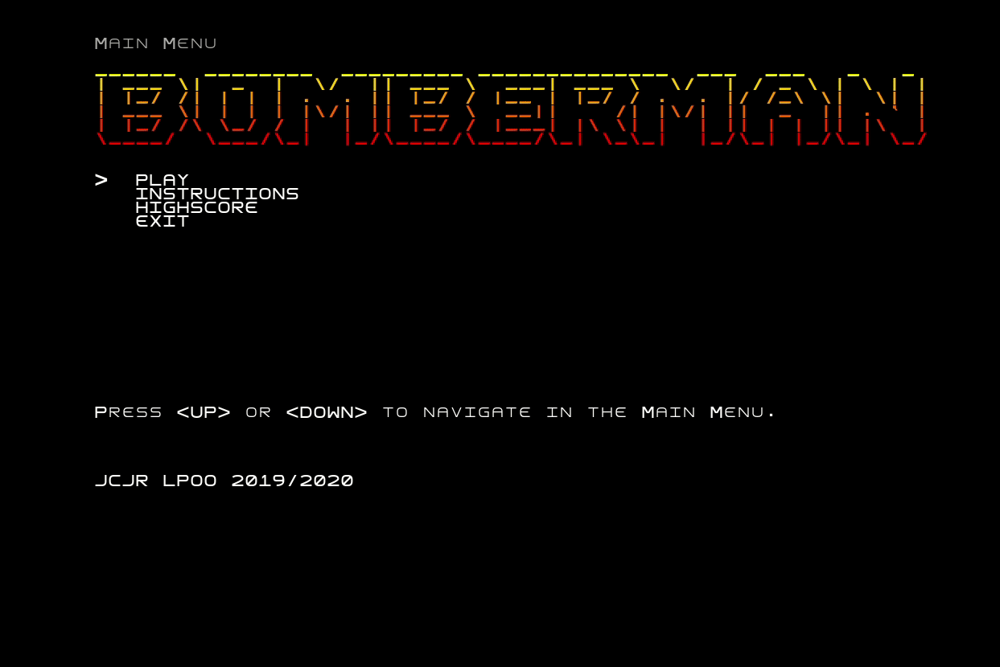
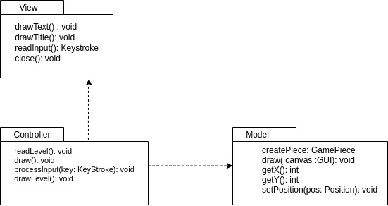
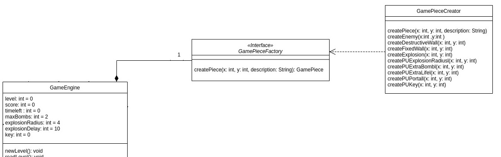
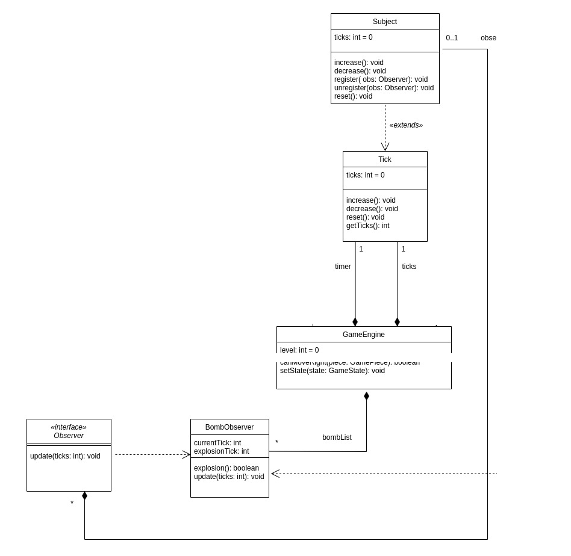
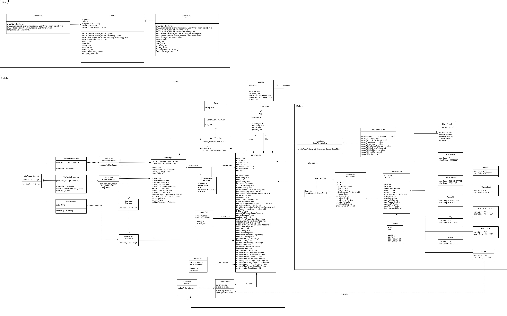
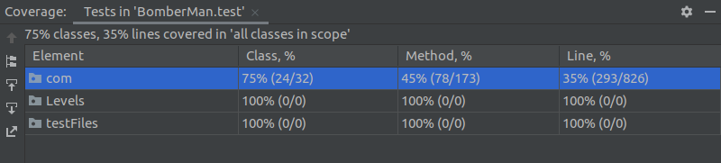

# LPOO_41 - BomberMan

Neste projecto, pretendemos desenvolver um jogo semelhante ao clássico **BomberMan**, usando funcionalidades do jogo originais e acrescentando 
outras que entendemos que contribuem para um jogo mais apelativo e interessante.

Projecto desenvolvido no âmbito da UC LPOO 2019/20 por 
- João Carlos Machado Rocha Pires (up201806079)
- João Oliveira da Rocha (up201708566)

## Funcionalidades

### Funcionalidades Implementadas

- Menu Principal com quatro opções: *Play*, *Highscores*, *Intructions* e *Exit*.
- A opção *Highscores* levará a um ecrã que mostrará os dez melhores *highscores*, armazenados num ficheiro de texto, ordenados por ordem decrescente de pontuação (*score*).
- Após o término de um jogo, e no caso do jogador ter um highscore positivo, o seu resultado será guardado no ficheiro dos highscores.
- A opção *Instructions* conduz a um ecrã que demonstra quais as instruções e objectivos para passar o jogo.
- A opção *Exit*, como é óbvio, será para sair do jogo.

#### Gameplay

- Ao premir as setas, o *BomberMan* move-se. Ao pressionar a tecla 'b', o *BomberMan* larga uma bomba.
- A bomba terá um certo *delay* entre a sua colocação e a explosão. Também terá um raio de explosão. Ambos podem ser influenciados por *Power-ups*.
- As explosões interagem com inimigos, paredes destrutíveis, outras bombas e o jogador em si.
- Existirão inimigos pelo mapa. O movimento deles será aleatório. Morrem em contacto com a explosão de uma bomba.
- Uma explosão deverá destruir uma parede destrutível que, por sua vez, deverá largar um *power-up* no seu local.
- Existem os seguintes *power-ups* no jogo:
  - *Extra Life* (adiciona uma vida ao *BomberMan*)
  - *Extra Bomb* (adiciona uma bomba à lista de bombas que podem ser plantadas em simultâneo)
  - *Explosion Radius* (aumenta o raio da explosão de uma bomba)
- Uma explosão despelotará outra bomba antes do seu tempo de estouro, levando a uma reação em cadeia e uma nova mecânica de jogo.
- O score é aumentado a 100 sempre que um inimigo é abatido e a 10 sempre que é derrubada uma parede.
- Cada jogador terá 3 vidas. Cada vida é perdida sempre que colide com um inimigo ou é afetado pela bomba que planta. Assim que perder as 3 vidas, o jogo acaba (existe a possibilidade de apanhar vidas extra).
- O jogo pode ser pausado, originando um decréscimo no score de 50 e uma paragem de tempo e de ação do jogo até que volte a ser retomado.
- Sempre que o jogador perde uma vida, continua no nível atual, na mesma situação em que estava imediatamente antes de ter perdido a vida, ou seja, com o número de inimigos igual ao que estava presente e o mesmo para o número de paredes.
- Existem 10 níveis de jogabilidade com mapas gerados a partir de ficheiros de texto. A dificuldade aumenta com o aumento do número do nível resultando num aumento do número de inimigos (+1 do que no nível anterior) e no aumento do número de paredes "destrutíveis". 
Ou seja, os primeiros níveis terão menos paredes para destruir e menos inimigos.
- Um nível é completado sempre que todos os inimigos são mortos ou sempre que se encontra o par chave-portal.
- O par chave-portal pode ser encontrado da seguinte forma: se uma parede for destruída, no seu local poderá aparecer ou um *powerup*
ou uma chave. A partir do momento em que a chave for descoberta, poderá aparecer, em vez de um *powerup*, um portal que permite assim
completar o nível e passar para o nível seguinte (ou completar o jogo se o nível actual for o nível 10). O portal nunca aparece antes
da chave ter sido encontrada e "guardada" pelo *BomberMan*.
- Cada nível tem ainda um tempo para o tornar desafiante. No nível 1, o tempo disponível são 5 minutos. 
De nível para nível, o tempo diminui em 3 segundos em relação ao nível anterior.
- O tempo restante após completar um determinado nível influencia também o score, na medida em que o número de
segundos restantes é adicionado ao mesmo.

De seguida, demonstra-se através de um *GIF* a jogabilidade:

### Funcionalidades Não Implementadas

- Modo Arena 1 vs.1: Multiplayer. Vários tipos de bomba. Objetivo: encurralar o adversário.

## Design Patterns

### Modelação do Jogo 
 
#### Contexto do problema
 
De forma a organizar as dependências do nosso jogo e modelar a sua estrutura, tendo um número elevado de classes e de métodos, responsáveis quer pelo processamento quer pelo desenho
dos elementos do jogo (aspecto gráfico), vimos necessidade de recorrer ao uso de uma *design pattern* que nos ajudasse nesse sentido.

#### *MVC Pattern*

Desta forma, para este projeto, decidimos utilizar uma arquitetura MVC (*Model* - *View* - *Controller*) para garantir a facilidade de compreensão e manutenção a futuros *maintainers*, bem como para possibilitar possíveis adaptações e extensões do código. Consideramos que o modelo MVC se adapta ao nosso projeto devido às razões já mencionadas e ao facto de permitir uma organização baseada em dependências de responsabilidades.

#### Implementação

Sendo esta *design pattern* a mais genérica do nosso programa, é a que engloba todas as classes, sem excepção que utilizamos.

#### Consequências da sua utilização

Apesar da lógica (*Controller*) e modelos de jogo (*Model*) estarem escritos em Java simples, estamos a utilizar o *lanterna* como nosso *framework* para interface gráfica. Caso fosse necessário migrar o jogo para uma outra interface, o modelo MVC permitiria que, em princípio, apenas tivéssemos de modificar a *View*, sem precisar de alterar código do *Model* ou *Controller* para garantir o bom funcionamento do jogo.

Uma outra vantagem/consequência de utilizar MVC e interfaces a ligar os *packages* de *Model*, *Views* e *Controllers* é que para interagirem entre si precisam de "comunicar" com interfaces. Ou seja, nenhum *package* precisa necessariamente de um objeto de uma classe específica, apenas precisa de objetos que respeitem a interface.

### Modelação do Elementos do Jogo 

#### Contexto do problema

Tendo vários elementos constituintes do nosso jogo (*player*, *enemies*, *bombs*, *power-ups*, etc.), sentimos necessidade de organizar o código de forma a permitir que o *Controller* os pudesse instanciar sem ter de ser preocupar sobre qual o tipo de objecto criado. 

#### *Factory Method*

Desta forma, recorremos ao padrão *Factory Method* para fazer com que uma interface (*GamePieceFactory*) fosse responsável por definir uma método a ser implementado na classe *GamePieceCreator*, método este que permite ao *Controller* instanciar objectos do jogo sem ter de ser preocupar com o tipo de objecto criado. Assim, a classe *GameEngine* poderá interagir com os elementos do jogo que foram instanciados sem que a mesma soubesse que tipo de elemento e qual o comportamento representava.

#### Implementação

As classes presentes no diagrama acima podem ser encontrada nos seguintes ficheiros Java:

- [GameEngine](../src/main/java/com/jcjr/bomberman/Controller/GameEngine.java)
- [GamePieceFactory](../src/main/java/com/jcjr/bomberman/Model/GamePieceFactory.java)
- [GamePieceCreator](../src/main/java/com/jcjr/bomberman/Model/GamePieceCreator.java)

#### Consequências da sua utilização

As consequências directas da utilização da *Factory Method* são a facilidade associada a uma eventual adição de um elemento do jogo (p.e. a adição de um novo *Power-up* ou um novo tipo de inimigo) e a capacidade do *GameEngine* poder instanciar esse novo elemento sem ter de se preocupar com o novo comportamento associado ao novo elemento.

Estudou-se ainda a hipótese de utilização do padrão *Abstract Factory* para a utilização de fábricas diferentes para *Power-ups* ou peças regular. Escolhemos continuar com a *Factory Method* pois consideramos que o reduzido número de classes e diferenças não justificava o aumento de complexidade.

### Explosão de uma bomba em função do tempo desde a sua colocação

#### Contexto do problema

Tendo o nosso jogo a bomba com um dos elementos, está associada ao comportamento da mesma a sua explosão. Esta explosão depende do número de *ticks* que são incrementados desde a sua colocação, por parte do *BomberMan*, até à efectiva explosão. Estes *ticks* são usados, para além disto, para o movimento dos inimigos. Cada *tick* corresponde ao movimento do *BomberMan*, que despoleta o movimento dos inimigos.

#### *Observer*

Desta forma, usamos a *Design Pattern Observer* para que, ao fazer uma alteração no parâmetro *ticks*, seja também possível alterar os *ticks* até uma bomba rebentar. 

#### Implementação

As classes presentes no diagrama acima podem ser encontrada nos seguintes ficheiros Java:

- [GameEngine](../src/main/java/com/jcjr/bomberman/Controller/GameEngine.java)
- [Subject](../src/main/java/com/jcjr/bomberman/Controller/Subject.java)
- [Tick](../src/main/java/com/jcjr/bomberman/Controller/Tick.java)
- [BombsObserver](../src/main/java/com/jcjr/bomberman/Controller/BombsObserver.java)
- [Observer](../src/main/java/com/jcjr/bomberman/Controller/Observer.java)

#### Consequências da sua utilização

A vantagem de utilizar este padrão é que evita a necessidade de, a cada alteração aos *ticks*, ter de alterar manualmente o parâmetro em *BombsObserver*. Desta forma, basta registar um *BombsObserver* como observador dos *ticks* na sua criação e, depois de cada alteração, basta chamar o método *update* que notifica todos os observadores / *BombsObservers* a fazerem um *update*. Cada bomba poderá depois utilizar os ticks atuais para se fazer explodir.

### Diagrama UML Geral

## Code Smells and Refactoring

### *Bloaters - Large Class*

As classes [GameEngine](../src/main/java/com/jcjr/bomberman/Controller/GameEngine.java) 
e [MenuEngine](../src/main/java/com/jcjr/bomberman/Controller/MenuEngine.java) são classes longas, com 47 e 13 métodos cada, respectivamente.

Ora, classes tão longas podem gerar código e funcionalidades duplicadas.

Uma das soluções poderia passar por extrair todos os métodos relacionados com o desenho de componentes do Menu Principal e do 
ecrã de Jogo para uma classe à parte responsável por desenhar os componentes em função do ecrã que estiver a ser apresentado.

Tal resolução está associada ao *Refactoring Extract Class*.

### *Dispensables - Data Class*

A classe [GameStates](../src/main/java/com/jcjr/bomberman/Controller/GameStates.java) contém apenas um *enum* de estados do jogo possíveis.

Uma vez que a classe é apenas usada para este propósito, uma das soluções poderia passar por mover o enum para a classe 
[GameController](../src/main/java/com/jcjr/bomberman/Controller/GameController.java), uma vez que é esta classe a responsável pelos ecrãs Menu Principal e de Jogo. 

Tal resolução está associada ao *Refactoring Inline Class*.

### *Object-Orientation Abusers - Switch Statements*

O método *createPiece()* da classe [GamePieceCreator](../src/main/java/com/jcjr/bomberman/Model/GamePieceCreator.java) contém um longo e *Switch Statement* para criar
um elemento de jogo em função do parâmetro *Description* (do tipo *String*) que recebe.

Há ainda um problema extra associado a este *Code Smell*, que se verificará no caso de ter de ser adicionado um elemento novo no jogo.

A solução para resolver este problema poderá passar por recorrer ao polimorfismo, criando subclasses que se comportam em função do seu tipo, que por sua vez está relacionado com o
elemento do jogo em questão.

Tal resolução está associada ao *Refactoring Replace Conditional with Polymorphism*.

## Testing

### *Coverage Report*

### *Mutation Testing*
[Mutation Testing](../build/reports/pitest/202005312310/index.html)

## Auto-avaliação

A percentagem de contribuição de cada elemento do grupo para a elaboração do código e do relatório foi de:

João Carlos Machado Rocha Pires (up201806079): 50%

João Oliveira da Rocha (up201708566): 50%
